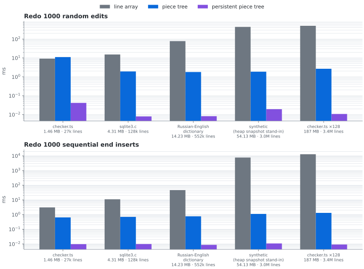
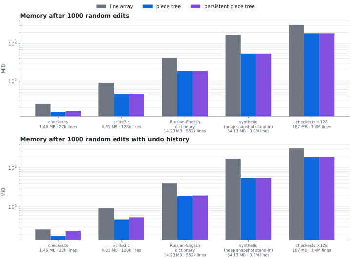

# Piece Tree

[](https://github.com/rebornix/PieceTree/actions/workflows/ci.yml)

The underling text buffer used in VS Code/Monaco. For detailed architecture behind it, please read [Text Buffer Reimplementation](https://code.visualstudio.com/blogs/2018/03/23/text-buffer-reimplementation).

```
npm install github:rebornix/PieceTree
```

The library is compiled from source when it is installed (a `prepare` script runs `tsc`), so the install needs no global tools and always matches the commit it was installed from. Add `#<commit>` to the URL to pin a specific revision.

## API

```typescript
const pieceTreeTextBufferBuilder = new PieceTreeTextBufferBuilder();
pieceTreeTextBufferBuilder.acceptChunk('abc\n');
pieceTreeTextBufferBuilder.acceptChunk('def');
const pieceTreeFactory = pieceTreeTextBufferBuilder.finish(true);
const pieceTree = pieceTreeFactory.create(DefaultEndOfLine.LF);

pieceTree.getLineCount(); // 2
pieceTree.getLineContent(1); // 'abc'
pieceTree.getLineContent(2); // 'def'

pieceTree.insert(1, '+');
pieceTree.getLineCount(); // 2
pieceTree.getLineContent(1); // 'a+bc'
pieceTree.getLineContent(2); // 'def'
```

### Persistent piece tree

`PersistentPieceTree` is the same text buffer on a [persistent](https://en.wikipedia.org/wiki/Persistent_data_structure) red-black tree: an edit never modifies the tree, it builds a new root that shares everything it did not touch with the previous one. A version of the document is therefore a root plus a few scalars, O(1) to take and O(1) to return to, and undo/redo is a stack of versions instead of a stack of inverse edits. The factory builds one with `createPersistent`; the read and edit API is that of `PieceTreeBase`.

```typescript
const tree = pieceTreeFactory.createPersistent(DefaultEndOfLine.LF);

const before = tree.getVersion();       // O(1)
tree.insert(1, '+');
tree.getLineContent(1);                 // 'a+bc'
tree.restoreVersion(before);            // O(1)
tree.getLineContent(1);                 // 'abc'

const history = new PieceTreeHistory(tree, 1000); // keeps at most 1000 undo stops
history.pushUndoStop();                 // before a change or a group of changes
tree.insert(0, '> ');
tree.delete(5, 1);
history.undo();                         // back to the undo stop, in O(1)
history.redo();                         // an edit after an undo discards the redo stack, as in an editor
```

Versions keep the tree nodes they were taken with alive, which is O(log n) nodes per edit; the text buffers are shared by all versions (the change buffer only ever grows). The idea and the design follow [fredbuf](https://github.com/cdacamar/fredbuf), described in [Text Editor Data Structures](https://cdacamar.github.io/data%20structures/algorithms/benchmarking/text%20editors/c++/editor-data-structures/).

## Correctness testing

`npm test` runs the VS Code piece tree test suite (ported), the builder tests and a differential fuzzer (random editing sessions compared after every edit with a trivially correct array-of-lines buffer, `src/test/linesTextBuffer.ts`) twice: once on `PieceTreeBase` and once on `PersistentPieceTree`. Failures of the differential tests print a shrunk, replayable scenario that can be pinned as a regression test.

`npm run fuzz` is the long-running version of that, for as many cores and minutes as you give it:

```
npm run fuzz                          # all cores but one, 10 minutes
npm run fuzz -- --minutes 60          # a longer campaign
npm run fuzz -- --seed 7 --workers 1  # reproducible single-process run
npm run fuzz -- --json report.json    # also save the statistics and any failure
```

Every scenario is a random editing session (document size from empty to several hundred KB, edit size from single characters to inserts above the 64 KB buffer chunk size, normalized or mixed line endings, `setEOL` in the middle) applied step by step to three buffers: the persistent piece tree, `PieceTreeBase`, and the array-of-lines buffer. After every edit the three must agree on the text, the line count and a sample of line, offset/position and range queries; at checkpoints and at the end every public query of both trees is compared with the model exhaustively and the tree invariants are checked. The persistent tree is also tested for what only it can do: a version is taken after every edit and old versions are restored and re-read while the session goes on; half of the sessions branch off random earlier versions and continue editing from there, the other half drive a `PieceTreeHistory` and finally undo and redo every edit, then walk the undo stops at random. A divergence is shrunk and printed as a scenario to pin in `src/test/differential.test.ts`; planted bugs (a dropped CRLF fix-up, a `redo()` that forgets the version it leaves, a `restoreVersion()` that forgets the buffers) are each found within seconds. The [Fuzz workflow](.github/workflows/fuzz.yml) runs a 30-minute campaign on demand.

The last campaign on this branch (`npm run fuzz -- --minutes 60 --workers 7 --seed 20260908`, Node 22.14; statistics in [`docs/fuzz/campaign-2026-09-08.json`](docs/fuzz/campaign-2026-09-08.json), reproducible with `--scenarios 35274` instead of the time budget): 35,274 scenarios, 9,184,550 edits each followed by the three-way comparison, 13,754,036 exhaustive comparisons of a tree with the model, 26,669,618 old versions restored and re-read, 182,479 branches off earlier versions, 18,460,368 undo/redo steps, 183,960 `setEOL`, 6,529 inserts above the buffer chunk size, largest document 944,909 characters. No divergence. A second campaign with seed 20260909 (45 minutes, [`docs/fuzz/campaign-2026-09-08-b.json`](docs/fuzz/campaign-2026-09-08-b.json)): 14,289 scenarios, 3,727,110 edits, 10,823,788 versions re-read, no divergence.

## Benchmarks

`npm run bench` reproduces the comparisons of the [Text Buffer Reimplementation](https://code.visualstudio.com/blogs/2018/03/23/text-buffer-reimplementation) post between the piece tree and the line array it replaced, using the workloads of the text buffer benchmarks VS Code had at the time:

1. memory usage after loading a file
2. file opening time: building the buffer from the 64 KB chunks `fs.readFile` delivers
3. editing: 1000 random edits (replace or delete a random range of a random line), 1000 sequential inserts (typing at the end of the document)
4. reading: `getLineContent` for all lines, and for 10 windows of 100 lines, after those edits
5. saving: reading back the full text after those edits

and, since the persistent piece tree runs alongside as a third implementation, two workloads for what its versions buy:

6. undo and redo: taking those 1000 edits back and replaying them one by one, as edits for the line array and the piece tree (how VS Code's undo stack works) and as versions for the persistent tree; each direction is timed separately, and the harness checks the restored document
7. memory after those edits, without and with the undo history alive

The baseline ([`src/benchmark/lineArrayBuffer.ts`](src/benchmark/lineArrayBuffer.ts)) is a compact port of VS Code 1.21's `LinesTextBuffer`: an array of line strings plus lazily recomputed prefix sums of the line lengths for offset/position conversion. Both buffers are driven the way `TextModel.applyEdits` drove them (line/column range in; offset, length and replaced text out), and the harness checks that all implementations agree on every result (including the document an undo restores), so it also acts as a differential test. Edits are generated from a seed and identical for all buffers. The real files from the post are vendored in [`test/benchmark/corpus`](test/benchmark/corpus) with their upstream licenses and attribution.

```
npm run bench                       # synthetic documents shaped like the post's files (~30 s)
npm run bench -- --corpus           # run on the post's vendored files
npm run bench -- --corpus --huge    # add the 3M-line category (several minutes)
npm run bench -- --json r.json      # also save all samples and environment info
npm run bench -- --help             # all options (--iterations, --file, --seed, ...)
```

### Results

Measured with `npm run bench -- --corpus --huge --iterations 5` on Node 22.14
(V8 12.4), macOS, and an Apple M5 Max. Every timed round runs the line array,
piece tree, and persistent piece tree in sequence against identical edits. The
charts and table use medians and logarithmic axes; all samples and the
synthetic small/medium/large results are in
[`docs/benchmark/results-m5-max.json`](docs/benchmark/results-m5-max.json).

The files shown are the three inputs from the original post, a synthetic 54 MB
/ 3M-line stand-in for its unpublished Chromium heap snapshot, and
`checker.ts` repeated 128 times. The original conclusions still hold, while the
persistent tree stays close to the mutable piece tree in ordinary work and
makes history navigation effectively independent of document size.

**Memory and opening.** The line array retains 1.7–3.2x the heap of the piece
tree. The persistent tree adds at most 7% before any edits. Opening is similar
on files up to 128k lines; on the larger files both piece trees are faster.


**Editing.** Both piece trees remain around 0.6–3.2 ms for 1000 edits as the
document grows. The line array reaches 560 ms for random edits and 10 seconds
for sequential end inserts on the 187 MB document. Path copying makes the
persistent tree 4–44% slower for random edits; sequential inserts are
comparable.


**Reading and saving.** Direct line-array indexing is 16–25x faster when every
line is scanned. A more editor-like read of ten 100-line windows remains below
0.13 ms for either piece tree. Reading the full text for saving favors the
piece trees, especially on large line counts.


**Undo and redo.** The line array and mutable piece tree apply inverse or
forward edits. The persistent tree restores roots; the median for all 1000
pointer swaps is below 0.05 ms in these runs, independent of document size.
These timings measure navigation after the history has been recorded, not the
cost of recording it.




**History memory.** Keeping 1000 random-edit versions adds 0.8–1.0 MB to the
persistent tree across this 1.5–187 MB range. That is the copied root paths;
document text and untouched nodes remain shared.



<details>
<summary>Selected medians (each cell is line array → piece tree → persistent piece tree)</summary>

| workload | checker.ts<br>1.46 MB, 27k lines | sqlite3.c<br>4.31 MB, 128k lines | Russian-English dictionary<br>14.2 MB, 552k lines | synthetic<br>54 MB, 3.0M lines | checker.ts x 128<br>187 MB, 3.4M lines |
|---|---|---|---|---|---|
| memory after load | 2.5 → 1.4 → 1.5 MB | 9.1 → 4.4 → 4.4 MB | 40.6 → 18.6 → 18.6 MB | 172.9 → 54.5 → 54.5 MB | 315.3 → 188.2 → 188.2 MB |
| file opening | 2.14 → 2.03 → 2.06 ms | 6.25 → 6.32 → 6.36 ms | 32.77 → 22.12 → 16.18 ms | 193.8 → 111.5 → 96.95 ms | 333.3 → 267.2 → 247.8 ms |
| 1000 random edits | 3.42 → 1.56 → 1.86 ms | 15.39 → 1.50 → 1.69 ms | 78.18 → 1.72 → 1.84 ms | 446.0 → 1.99 → 2.08 ms | 560.0 → 2.23 → 3.20 ms |
| 1000 sequential inserts | 5.84 → 0.752 → 0.706 ms | 17.10 → 0.615 → 0.557 ms | 51.98 → 0.975 → 0.563 ms | 7.48 s → 1.19 → 0.956 ms | 10.09 s → 1.02 → 0.813 ms |
| read all lines after random edits | 0.137 → 2.48 → 2.92 ms | 0.676 → 10.94 → 12.03 ms | 2.46 → 48.60 → 53.12 ms | 15.64 → 255.7 → 293.4 ms | 12.73 → 284.0 → 310.7 ms |
| read ten 100-line windows | 0.007 → 0.098 → 0.106 ms | 0.014 → 0.099 → 0.110 ms | 0.021 → 0.116 → 0.127 ms | 0.021 → 0.097 → 0.105 ms | 0.027 → 0.094 → 0.102 ms |
| save after random edits | 0.578 → 0.279 → 0.223 ms | 9.41 → 6.11 → 1.18 ms | 15.38 → 1.76 → 1.69 ms | 61.13 → 4.84 → 4.94 ms | 75.52 → 15.34 → 15.41 ms |
| undo 1000 random edits | 3.78 → 1.64 → 0.013 ms | 15.37 → 1.88 → 0.009 ms | 78.52 → 1.83 → 0.017 ms | 443.5 → 2.40 → 0.019 ms | 505.8 → 2.90 → 0.012 ms |
| redo 1000 random edits | 9.16 → 11.05 → 0.041 ms | 15.21 → 1.91 → 0.008 ms | 77.41 → 1.79 → 0.008 ms | 439.9 → 1.86 → 0.019 ms | 502.2 → 2.65 → 0.011 ms |
| memory after random edits with history | 2.6 → 1.8 → 2.4 MB | 9.3 → 4.8 → 5.4 MB | 40.7 → 19.0 → 19.6 MB | 173.1 → 54.9 → 55.6 MB | 315.5 → 188.6 → 189.4 MB |

</details>
