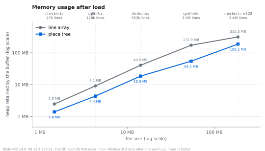
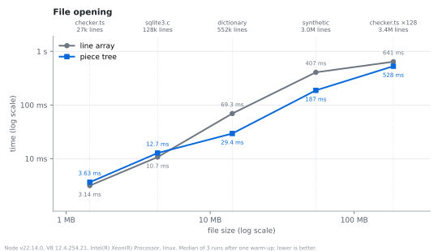
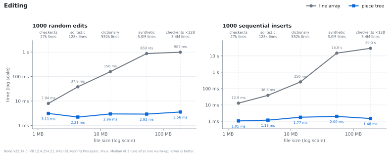
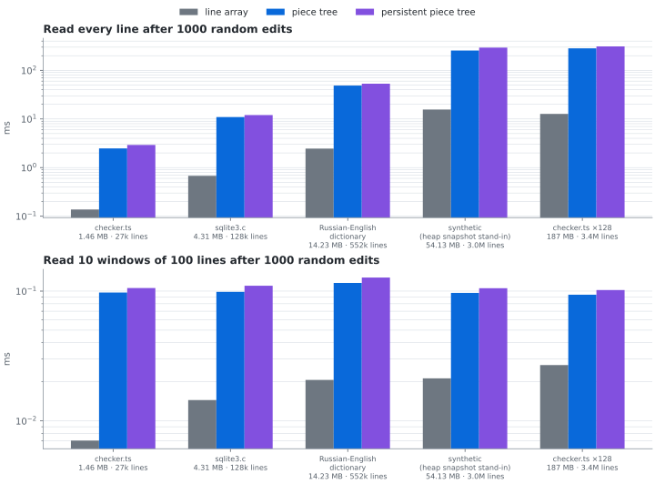
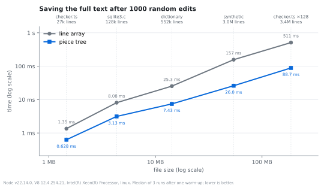
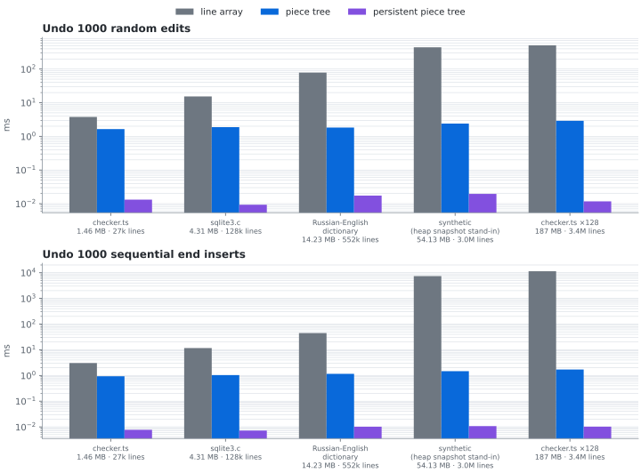

# Piece Tree

[](https://github.com/rebornix/PieceTree/actions/workflows/ci.yml)

The underling text buffer used in VS Code/Monaco. For detailed architecture behind it, please read [Text Buffer Reimplementation](https://code.visualstudio.com/blogs/2018/03/23/text-buffer-reimplementation).

```
npm install github:rebornix/PieceTree
```

The library is compiled from source when it is installed (a `prepare` script runs `tsc`), so the install needs no global tools and always matches the commit it was installed from. Add `#<commit>` to the URL to pin a specific revision.

## API

```typescript
const pieceTreeTextBufferBuilder = new PieceTreeTextBufferBuilder();
pieceTreeTextBufferBuilder.acceptChunk('abc\n');
pieceTreeTextBufferBuilder.acceptChunk('def');
const pieceTreeFactory = pieceTreeTextBufferBuilder.finish(true);
const pieceTree = pieceTreeFactory.create(DefaultEndOfLine.LF);

pieceTree.getLineCount(); // 2
pieceTree.getLineContent(1); // 'abc'
pieceTree.getLineContent(2); // 'def'

pieceTree.insert(1, '+');
pieceTree.getLineCount(); // 2
pieceTree.getLineContent(1); // 'a+bc'
pieceTree.getLineContent(2); // 'def'
```

### Persistent piece tree

`PersistentPieceTree` is the same text buffer on a [persistent](https://en.wikipedia.org/wiki/Persistent_data_structure) red-black tree: an edit never modifies the tree, it builds a new root that shares everything it did not touch with the previous one. A version of the document is therefore a root plus a few scalars, O(1) to take and O(1) to return to, and undo/redo is a stack of versions instead of a stack of inverse edits. The factory builds one with `createPersistent`; the read and edit API is that of `PieceTreeBase`.

```typescript
const tree = pieceTreeFactory.createPersistent(DefaultEndOfLine.LF);

const before = tree.getVersion();       // O(1)
tree.insert(1, '+');
tree.getLineContent(1);                 // 'a+bc'
tree.setVersion(before);                // O(1)
tree.getLineContent(1);                 // 'abc'

const history = new PieceTreeHistory(tree, 1000); // keeps at most 1000 undo points
history.snapshot();                     // an undo point, before a change or a group of changes
tree.insert(0, '> ');
tree.delete(5, 1);
history.undo();                         // back to the snapshot, in O(1)
history.redo();
```

Versions keep the pieces they were taken with alive, which is O(log n) tree nodes per edit; the text buffers are shared by all versions (the change buffer only ever grows). The idea and the design follow [fredbuf](https://github.com/cdacamar/fredbuf), described in [Text Editor Data Structures](https://cdacamar.github.io/data%20structures/algorithms/benchmarking/text%20editors/c++/editor-data-structures/).

## Benchmarks

`npm run bench` reproduces the comparisons of the [Text Buffer Reimplementation](https://code.visualstudio.com/blogs/2018/03/23/text-buffer-reimplementation) post between the piece tree and the line array it replaced, using the workloads of the text buffer benchmarks VS Code had at the time:

1. memory usage after loading a file
2. file opening time: building the buffer from the 64 KB chunks `fs.readFile` delivers
3. editing: 1000 random edits (replace or delete a random range of a random line), 1000 sequential inserts (typing at the end of the document)
4. reading: `getLineContent` for all lines, and for 10 windows of 100 lines, after those edits
5. saving: reading back the full text after those edits

and, since the persistent piece tree runs alongside as a third implementation, two workloads for what its versions buy:

6. undo: taking those 1000 edits back one by one, as inverse edits for the line array and the piece tree (how VS Code's undo stack works) and as versions for the persistent tree
7. memory after those edits with the undo history alive

The baseline ([`src/benchmark/lineArrayBuffer.ts`](src/benchmark/lineArrayBuffer.ts)) is a compact port of VS Code 1.21's `LinesTextBuffer`: an array of line strings plus lazily recomputed prefix sums of the line lengths for offset/position conversion. Both buffers are driven the way `TextModel.applyEdits` drove them (line/column range in; offset, length and replaced text out), and the harness checks that all implementations agree on every result (including the document an undo restores), so it also acts as a differential test. Edits are generated from a seed and identical for all buffers.

```
npm run bench                       # synthetic documents shaped like the post's files (~30 s)
npm run bench:corpus                # download the post's public files into bench-corpus/
npm run bench -- --corpus           # ... and run on them
npm run bench -- --corpus --huge    # add the 3M-line category (several minutes)
npm run bench -- --json r.json      # also save all samples and environment info
npm run bench -- --help             # all options (--iterations, --file, --seed, ...)
```

### Results

Measured with `npm run bench -- --corpus --huge --iterations 3` on Node 22.14 (V8 12.4), Linux, Intel Xeon, on the files of the post: `checker.ts` (TypeScript 2.7.1), `sqlite3.c` (emscripten 1.37.36), the Russian-English dictionary, and `checker.ts` repeated 128 times. The post's Chromium heap snapshot is not public, so a synthetic 54 MB / 3M-line document stands in for it. The synthetic small/medium/large documents give the same picture as the real files of the same size. The samples are in [`docs/benchmark/results.json`](docs/benchmark/results.json); the charts show the medians on linear axes, so the bars of the small files are barely visible next to the 187 MB one: their values are in the labels and in the table at the end.

The conclusions of the post hold on today's V8.

**Memory**: the piece tree stays close to the size of the text (the chunks plus the line-start tables), the line array needs 1.7–3x as much. The gap is smaller than in the post's chart because by VS Code 1.21 the line array already stored plain strings rather than `ModelLine` objects.



**File opening**: even up to ~100k lines; from a few hundred thousand lines on, splitting into line strings costs more than scanning for line breaks, and the piece tree opens the file 1.2–2.4x faster.



**Editing**: the piece tree takes 1–4 ms for 1000 edits regardless of file size. The line array's cost grows with the line count, since the prefix sums of line lengths are recomputed after every edit and, for every inserted line, reallocated; on a 3M-line file 1000 sequential inserts take tens of seconds.



**Reading**: the piece tree's Achilles heel. After 1000 edits `getLineContent` is 2–5x slower than an array index, but that is 40–55 ns per line when reading the whole file, and ten screenfuls of 100 lines are read in under 0.1 ms.



**Saving**: the piece tree hands out a few large substrings instead of joining hundreds of thousands of line strings, and is 2–6x faster.



<details>
<summary>The same numbers as a table (bold marks the faster buffer)</summary>

| line array → piece tree | checker.ts<br>1.46 MB, 27k lines | sqlite3.c<br>4.31 MB, 128k lines | Russian-English dictionary<br>14.2 MB, 552k lines | synthetic (heap snapshot stand-in)<br>54 MB, 3.0M lines | checker.ts x 128<br>187 MB, 3.4M lines |
|---|---|---|---|---|---|
| memory after load | 2.5 MB → **1.4 MB** | 9.1 MB → **4.4 MB** | 40.5 MB → **18.5 MB** | 172.9 MB → **54.5 MB** | 315.3 MB → **188.2 MB** |
| file opening | 3.14 ms → 3.63 ms | 10.68 ms → 12.71 ms | 69.26 ms → **29.37 ms** | 406.6 ms → **187.4 ms** | 640.6 ms → **528.4 ms** |
| 1000 random edits | 7.94 ms → **3.11 ms** | 37.95 ms → **2.21 ms** | 158.1 ms → **2.96 ms** | 868.7 ms → **2.92 ms** | 987.3 ms → **3.56 ms** |
| 1000 sequential inserts | 12.90 ms → **1.05 ms** | 38.58 ms → **1.18 ms** | 256.1 ms → **1.77 ms** | 14.8 s → **2.00 ms** | 29.0 s → **1.48 ms** |
| read all lines after 1000 random edits | 0.296 ms → 1.41 ms | 1.07 ms → 5.36 ms | 9.20 ms → 29.28 ms | 30.83 ms → 120.6 ms | 67.93 ms → 155.8 ms |
| read 10 windows of 100 lines after 1000 random edits | 0.013 ms → 0.060 ms | 0.018 ms → 0.068 ms | 0.047 ms → 0.092 ms | 0.048 ms → 0.062 ms | 0.070 ms → 0.099 ms |
| save (full text) after 1000 random edits | 1.35 ms → **0.628 ms** | 8.08 ms → **3.13 ms** | 25.31 ms → **7.43 ms** | 156.7 ms → **26.00 ms** | 510.6 ms → **88.71 ms** |

</details>

#### Persistent piece tree

Measured with `npm run bench -- --corpus --iterations 5` (same machine, samples in [`docs/benchmark/results-persistent.json`](docs/benchmark/results-persistent.json)). On the workloads above the persistent tree costs what path copying and a tree without parent pointers cost: the same as the piece tree, or slightly faster, for memory after load, file opening, sequential inserts and saving; 1.1–1.5x slower for random edits and 1.1–1.3x slower for reading lines. Undo is where the versions pay off: returning to a version is a pointer swap, whichever edit is undone and whatever the size of the document.



| line array → piece tree → persistent piece tree | checker.ts<br>1.46 MB, 27k lines | sqlite3.c<br>4.31 MB, 128k lines | Russian-English dictionary<br>14.2 MB, 552k lines |
|---|---|---|---|
| undo 1000 random edits, one by one | 7.69 ms → 2.90 ms → **0.020 ms** | 36.6 ms → 4.24 ms → **0.030 ms** | 156 ms → 2.93 ms → **0.035 ms** |
| undo 1000 sequential inserts, one by one | 7.40 ms → 1.56 ms → **0.026 ms** | 35.7 ms → 1.56 ms → **0.032 ms** | 230 ms → 1.93 ms → **0.039 ms** |
| memory after 1000 random edits, undo history kept | 2.61 MB → **1.58 MB** → 2.37 MB | 9.23 MB → **4.61 MB** → 5.27 MB | 40.7 MB → **18.8 MB** → 19.5 MB |
| memory after 1000 sequential inserts, undo history kept | 2.52 MB → **1.47 MB** → 1.94 MB | 9.17 MB → **4.37 MB** → 5.03 MB | 40.6 MB → **18.6 MB** → 19.3 MB |

The price of keeping 1000 versions is the nodes those 1000 edits allocated: 0.5–0.8 MB here whatever the size of the document, since an edit copies the path from the root to the edited piece, a dozen or so nodes and pieces. The inverse edits the other two buffers keep are smaller, a few numbers and the replaced text per edit.
